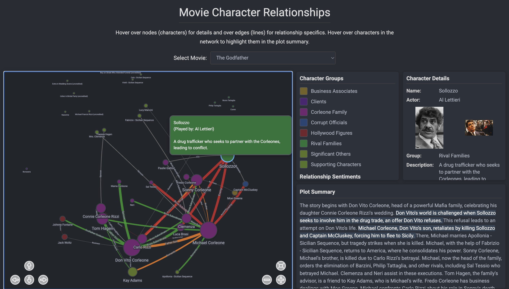

# Movie Character Relationship Network

<p align="center">
  
  <br>
  <i>(Consider replacing this placeholder with an actual screenshot or GIF of your application)</i>
</p>

An interactive web application to visualize and explore character relationships within movies. It loads movie data, including characters, their descriptions, and the relationships between them, from a YAML file and renders an interactive network graph using Vis.js. Users can select a movie from a dropdown, hover over characters and relationships for detailed information, and see dynamic highlighting of characters within the plot summary.

## ✨ Features

*   **Interactive Network Visualization:** Built with [Vis.js Network](https://visjs.github.io/vis-network/docs/network/) for a dynamic and engaging graph experience.
*   **Dynamic Movie Selection:** Choose from a list of movies loaded from your data source to explore different relationship networks.
*   **Detailed Hover Information:**
    *   **Characters:** Hover over a node to see the character's name, actor, group, detailed description, and associated images (actor and character-specific).
    *   **Relationships:** Hover over an edge to view its type, strength, sentiment (e.g., positive, negative, complicated), and a specific description.
*   **Dynamic Legend:** Automatically updates to show the character groups and relationship sentiments present in the currently selected movie's network.
*   **Plot Summary Panel:** Displays the plot synopsis for the selected movie, with an intelligent highlighting feature that emphasizes character names as you hover over their corresponding nodes in the network.
*   **Physics-Based Layout:** The graph uses a force-directed layout that simulates physical forces, providing an organic and easy-to-understand arrangement of nodes.
*   **Responsive Design:** Adapts to various screen sizes for a consistent user experience.
*   **Customizable Styling:** Nodes and edges are styled dynamically based on their properties (e.g., size based on connections, color based on group/sentiment, font size based on importance).

## 🚀 Technologies Used

*   **HTML5:** Structure of the web application.
*   **CSS3:** Styling and layout, featuring a modern dark theme.
*   **JavaScript (ES6+):** Core application logic and interactivity.
*   **[Vis.js Network](https://visjs.github.io/vis-network/docs/network/):** Powerful library for dynamic, browser-based network visualization.
*   **[js-yaml](https://github.com/nodeca/js-yaml):** For parsing YAML data directly in the browser.
*   **Google Fonts (Roboto):** For clean and modern typography.

## 📦 Setup and Installation

This project is a static web application and does not require any server-side setup or complex dependencies beyond a web browser.

1.  **Clone the repository:**
    ```bash
    git clone https://github.com/your-username/movie-character-network.git
    cd movie-character-network
    ```
    (Replace `https://github.com/your-username/movie-character-network.git` with your actual repository URL)

2.  **Ensure data files are present:**
    *   Place your movie character relationship data in a file named `clean_movie_database.yaml` in the root directory of the project.
    *   Create an `output/character_images/` directory in the root for character and actor images (see "Image Assets" below).

3.  **Open in Browser:** Simply open the `index.html` file in your preferred web browser.
    ```bash
    # From the project root, open index.html
    open index.html # macOS/Linux
    start index.html # Windows
    ```

## 💡 Usage

1.  **Select a Movie:** Use the "Select Movie" dropdown menu at the top to load the character network for a specific film.
2.  **Explore the Network:**
    *   **Nodes (Characters):** Each circle represents a character. Their size scales with the number of connections they have. Colors denote their respective groups.
    *   **Edges (Relationships):** Lines connecting characters represent relationships. Their thickness scales with "strength", and colors indicate "sentiment".
3.  **Get Details (Hover):**
    *   **Hover over a character node:** The "Character Details" panel on the right will display their name, actor, group, a description, and any associated images.
    *   **Hover over a relationship edge:** The "Relationship Details" panel will show the relationship type, sentiment, and description.
4.  **Highlight in Plot (Hover Character):** As you hover over a character node, their name will be highlighted in the "Plot Summary" panel below the details panel, helping you quickly locate their relevance in the story.
5.  **Graph Interaction:**
    *   **Zoom and Pan:** Use your mouse scroll wheel or the navigation buttons (top-left corner of the network) to zoom in/out and pan around the graph.
    *   **Fit View:** Click the "Fit" button (square icon) to re-center and fit the entire network into the view.
6.  **Click to Highlight:**
    *   **Click on a character node:** All other characters belonging to the same group will be highlighted.
    *   **Click on a relationship edge:** All other relationships with the same sentiment will be highlighted, along with their connected characters.

## 📂 Data Format (`clean_movie_database.yaml`)

The application expects its movie data in a YAML file named `clean_movie_database.yaml` at the root of the project. The structure for each movie entry should be as follows:

```yaml
- movie_title: "Your Movie Title Here"
  plot_with_character_constraints_and_relations: |
    A detailed plot summary of the movie, describing key events.
    Character names in this summary will be highlighted when their nodes are hovered.
  character_list:
    - name: "Character A"
      actor_name: "Actor Name A"
      group: "Protagonists" # Or "Antagonists", "Family", etc.
      description: "A brief description of Character A's role and personality."
      tmdb_person_id: 123456 # Optional: TMDB ID for actor/character image fetching
    - name: "Character B"
      actor_name: "Actor Name B"
      group: "Supporting"
      description: "Description for Character B."
      tmdb_person_id: 789012
  relationships:
    - source: "Character A"
      target: "Character B"
      type: "Friendship" # e.g., "Rivalry", "Family", "Love Interest"
      strength: 4        # 1-5, higher means stronger bond (affects edge thickness)
      sentiment: "positive" # "positive", "negative", "complicated", "neutral"
      description: "Their bond is strong, built on trust and shared experiences."
    - source: "Character B"
      target: "Character C"
      type: "Conflict"
      strength: 3
      sentiment: "negative"
      description: "They have a strained relationship due to past betrayals."
# ... more movies, characters, and relationships
```

## 🖼️ Image Assets (`output/character_images/`)

The application attempts to load character and actor images for the info panel. These images should be placed in the `output/character_images/` directory.

*   **Actor Images:** Should be named after the `tmdb_person_id` found in the YAML.
    *   Example: `123456.jpg`, `789012.png`
*   **Character-Specific Images:** Should follow a specific naming convention:
    *   `[tmdb_person_id]_char_[slugified_character_name]_[index].jpg`
        *   `[slugified_character_name]` is a lowercase, hyphen-separated version of the character's name (e.g., "character-a").
        *   `[index]` is usually `1` for the first image.
    *   Example: `123456_char_character-a_1.png`
*   **Fallback Character Images:** If a character has no `tmdb_person_id`, the application will try to load `[slugified_character_name]_char_unknown_id_[index].jpg`.

Supported image extensions (in order of preference): `.jpg`, `.png`, `.jpeg`, `.webp`.

## 🤝 Contributing

Contributions are welcome! If you have suggestions for improvements, new features, or bug fixes, please feel free to:

1.  Fork the repository.
2.  Create a new branch (`git checkout -b feature/your-feature`).
3.  Make your changes.
4.  Commit your changes (`git commit -m 'Add new feature'`).
5.  Push to the branch (`git push origin feature/your-feature`).
6.  Open a Pull Request.

## 📄 License

Apache 2.0